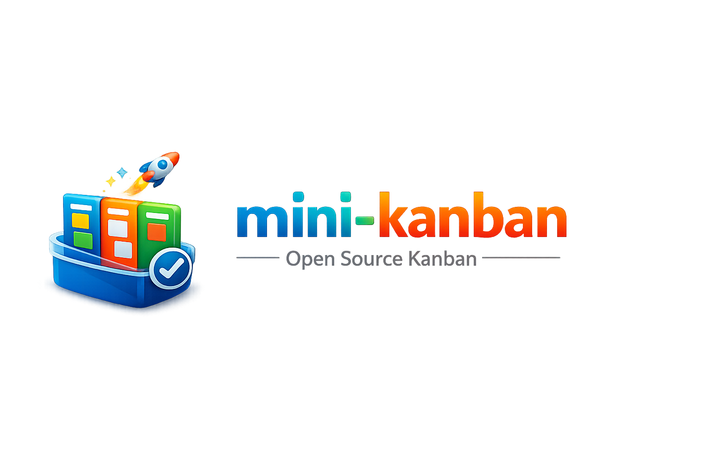

# Mini-Kanban




軽量・高速なタスク管理 CLI およびローカル Web アプリケーションです。

## 特徴

- 📝 シンプルな CLI コマンドでタスク管理
- 🌐 ローカル Web UI (htmx ベース)
- 🔍 タスク検索・フィルタリング機能
- 📁 プロジェクト別のタスク管理
- 💾 SQLite によるオフライン対応のローカルストレージ

## インストール

```bash
# npx で直接実行（インストール不要）
npx mini-kanban

# または、グローバルインストール
npm install -g mini-kanban
```

## 初期設定

初めて使用する場合は、`init` コマンドを実行して環境を初期化することをおすすめします。

```bash
mini-kanban init
```

これにより、以下の処理が行われます:
- 設定ファイルの作成 (`~/.config/mini-kanban/config.toml` など)
- データベースディレクトリの準備

## 使い方

### タスクの追加

```bash
# 基本的なタスク追加
mini-kanban add "タスクのタイトル"

# メモ付きで追加
mini-kanban add "タスクのタイトル" -n "詳細なメモ"

# ステータス指定で追加
mini-kanban add "タスクのタイトル" -s doing
```

### タスク一覧

```bash
# すべてのタスクを表示
mini-kanban ls

# ステータスでフィルタリング
mini-kanban ls -s todo
mini-kanban ls -s doing
mini-kanban ls -s done
```

### タスクの詳細表示

```bash
mini-kanban show <タスクID>
```

### タスクの編集

```bash
# タイトル変更
mini-kanban edit <タスクID> -t "新しいタイトル"

# ステータス変更
mini-kanban edit <タスクID> -s doing

# メモ追加
mini-kanban edit <タスクID> -n "メモ内容"
```

### タスクの完了・取り消し

```bash
# 完了にする
mini-kanban done <タスクID>

# 完了を取り消す
mini-kanban undo <タスクID>
```

### タスクの削除

```bash
mini-kanban rm <タスクID>
```

### プロジェクト管理

```bash
# プロジェクト一覧
mini-kanban project list

# 特定のプロジェクトを指定して操作
mini-kanban --project myproject add "タスク"
```

### Web UI

```bash
# ローカルWebサーバーを起動（デフォルト:8000番ポート）
mini-kanban web

# ポート指定
mini-kanban web -p 3000
```

ブラウザで `http://localhost:8000` にアクセスして Web UI を利用できます。

## 設定

### 環境変数

| 変数名 | 説明 | デフォルト |
|--------|------|------------|
| `MINI_KANBAN_DB` | データベースファイルのパス (優先) | (下記参照) |
| `MINI_KANBAN_PROJECT` | デフォルトプロジェクト名 | `default` |
| `MINI_KANBAN_LANG` | ヘルプの言語 (`en`, `ja`) | (自動検出) |

### 標準パスと XDG 変数

アプリは標準的な XDG ディレクトリ構成に従います。

- `XDG_CONFIG_HOME`: 設定ファイルの保存先。デフォルト: `~/.config/mini-kanban/`
- `XDG_DATA_HOME`: データベースファイルの保存先。デフォルト: `~/.local/share/mini-kanban/tasks.db`

> [!NOTE]
> `MINI_KANBAN_DB` が設定されている場合、それが最優先でデータベースパスとして使用されます。

### 国際化 (i18n)

CLI は日本語と英語のヘルプ表示に対応しています。

```bash
# 日本語でヘルプを表示
mini-kanban --lang ja --help

# 英語でヘルプを表示
mini-kanban --lang en --help
```

環境変数 `MINI_KANBAN_LANG` を設定することで、永続的に言語を固定することも可能です。

## 開発者向け情報

ビルド方法、ディレクトリ構成、リリース手順などは [開発者ガイド](docs/DEVELOPMENT.md) を参照してください。

## ライセンス

MIT License
